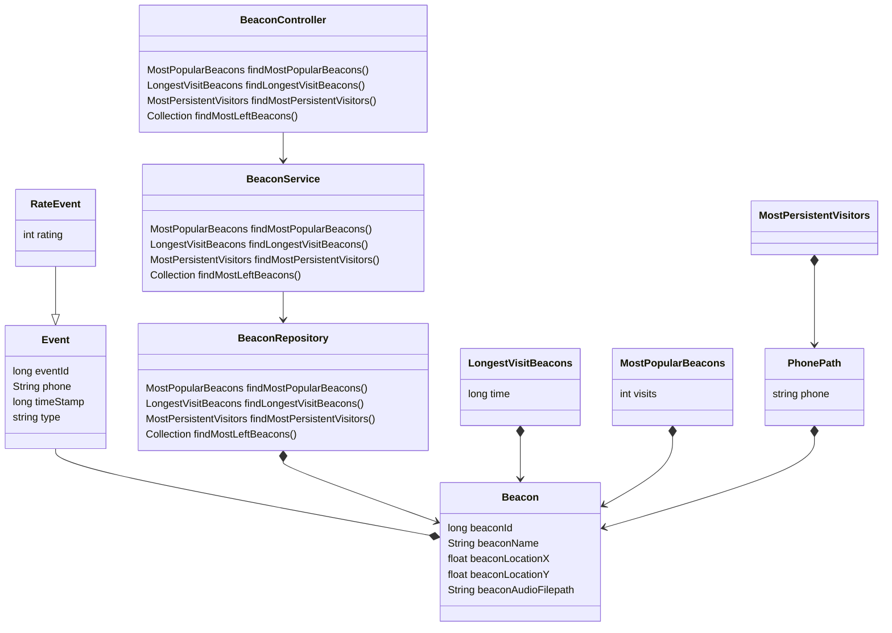

# Rijksmuseum - Challenge

One solution for challenge phase of "5 dana na javi" hackaton organized by Levi9.

## Environment

This project is developed on top of Apache Maven 3.6.2 and Java jdk 1.8.0_231.

## Build

In order to successfully build the project, given command should be executed in the root folder of project (where the pom.xml file is located):
```
mvn clean install
```

## Running the application

After successfully building the application, you can start it by executing given command in the same directory (where the pom.xml file is located):
```
mvn exec:java -D exec.mainClass=Rijksmuseum.App -D exec.args="BeaconFilePath EventFilePath Method Limit"
```

Example for parameters
```
mvn exec:java -D exec.mainClass=Rijksmuseum.App -D exec.args="./resources/beacons.csv ./resources/events.json 4 5"
```

## Technologies used in project

Maven - version 3.6.2
Java - jdk version 1.8.0_231
Version control - git

## Class diagram
